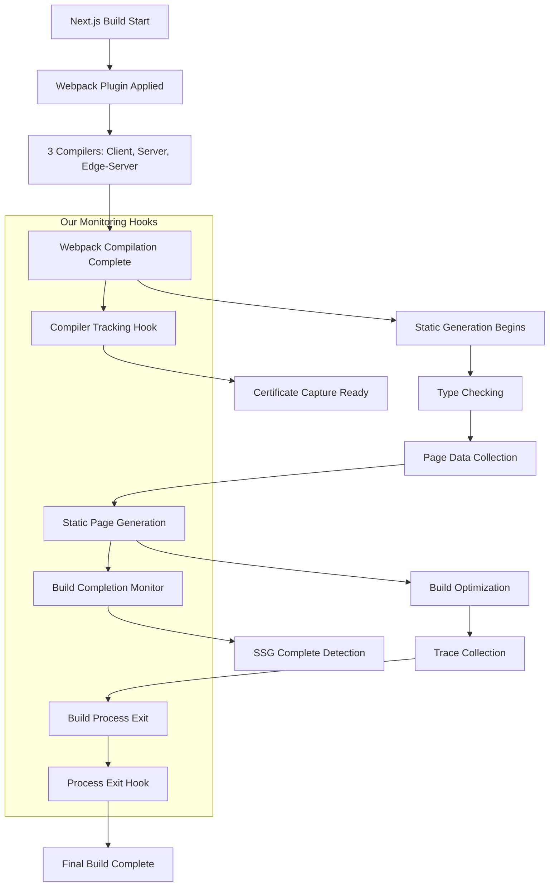
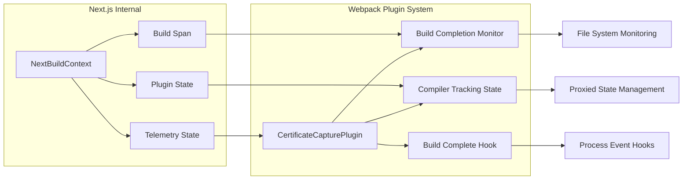
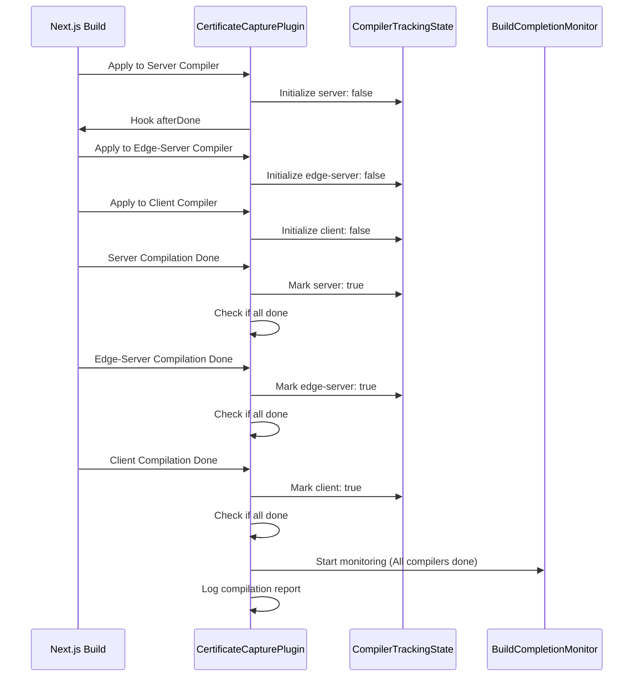
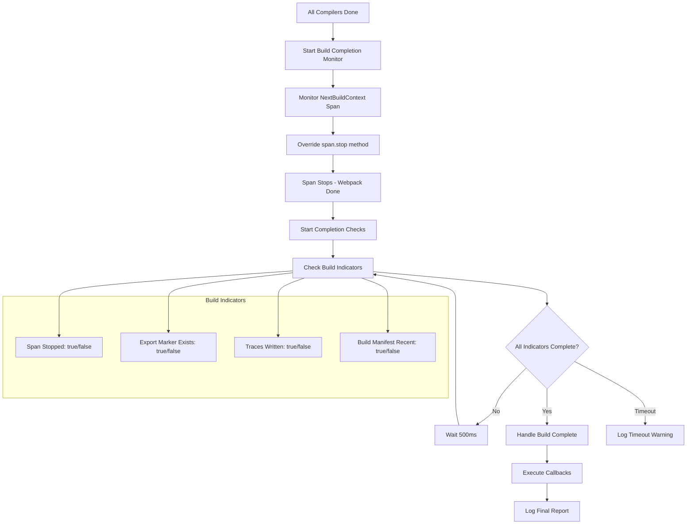
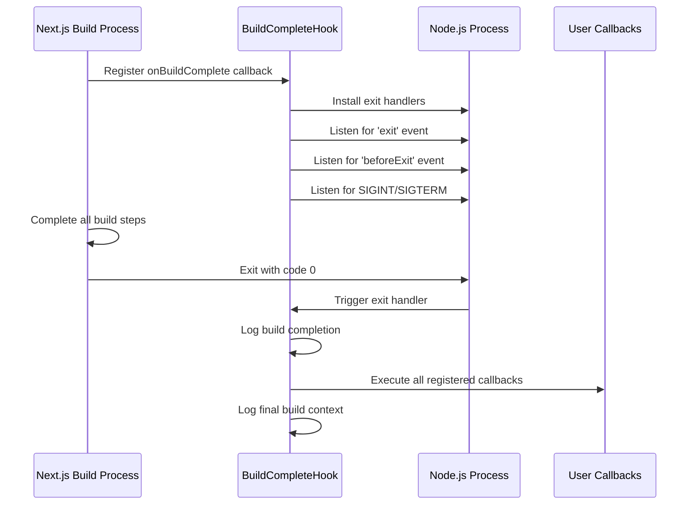
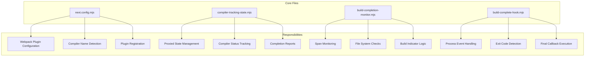
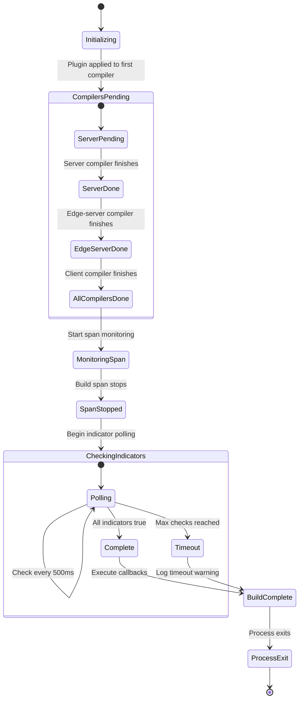
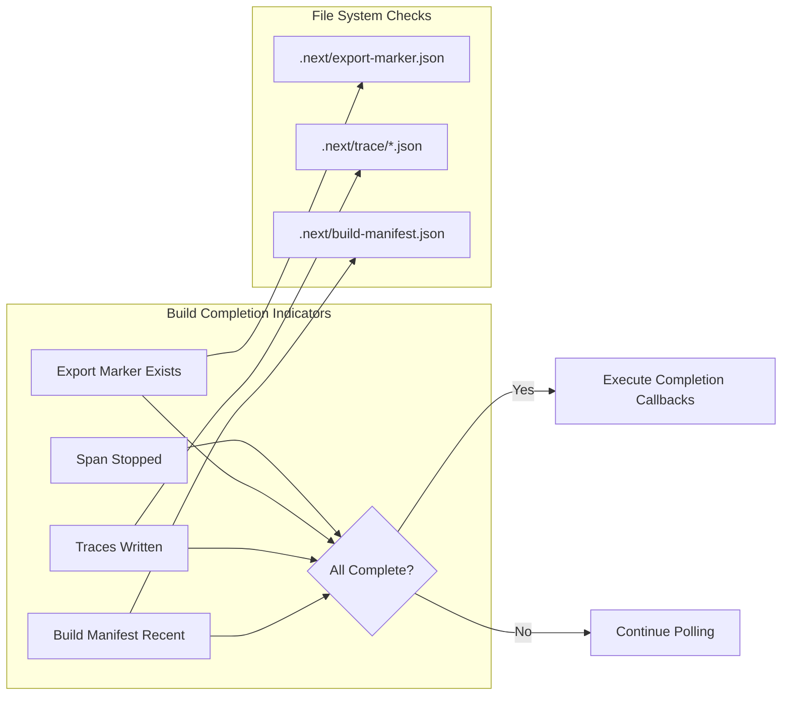

# Next.js Build Completion Monitoring

This document details the comprehensive system for monitoring Next.js build completion, including webpack compilation, static generation (SSG), and post-compile steps.

## Overview

The solution provides multiple hooks to detect different stages of the Next.js build process, from webpack compilation through final static generation and cleanup.

## Architecture



## Component Architecture



## Detailed Flow Diagrams

### 1. Compiler Tracking Flow



### 2. Build Completion Detection Flow



### 3. Process Exit Hook Flow



## File Structure and Responsibilities



## State Management Flow



## Detection Strategies Comparison

| Strategy | Timing | Reliability | Use Case |
|----------|---------|-------------|----------|
| **Compiler Tracking** | After webpack compilation | High | Certificate capture from webpack assets |
| **Span Monitoring** | During/after static generation | Medium | Detect SSG completion |
| **File System Checks** | Real-time during build | Medium | Verify build artifacts |
| **Process Exit Hook** | After entire build | High | Final cleanup and reporting |

## Build Indicators Explained



## Timeline Example

```mermaid
gantt
    title Next.js Build Timeline with Monitoring Hooks
    dateFormat X
    axisFormat %s
    
    section Webpack
    Server Compiler    :active, server, 0, 2000
    Edge-Server Compiler :active, edge, 500, 2500
    Client Compiler    :active, client, 1000, 3000
    
    section Our Hooks
    Compiler Tracking  :crit, track, 2000, 3000
    Span Monitoring    :monitor, 3000, 5000
    
    section Next.js Post-Compile
    Type Checking      :type, 3000, 3500
    Page Collection    :pages, 3500, 4000
    Static Generation  :ssg, 4000, 4500
    Optimization       :opt, 4500, 5000
    Trace Collection   :trace, 5000, 5200
    
    section Final Hook
    Process Exit Hook  :crit, exit, 5200, 5300
```



## Usage Examples

### Basic Certificate Capture

```javascript
// In your webpack plugin callback
buildCompleteHook.onBuildComplete(() => {
  console.log('Build complete - capturing certificates...');
  
  // Access build context
  const buildId = NextBuildContext.buildId;
  const distDir = NextBuildContext.distDir || '.next';
  
  // Capture certificates from build output
  captureCertificates(distDir);
});
```

### Advanced Build Monitoring

```javascript
// Monitor different stages
const trackingState = getSharedTrackingState();

// After webpack compilation
if (trackingState.areAllCompilersDone()) {
  const report = trackingState.getCompletionReport();
  console.log(`Webpack done in ${report.totalTime}ms`);
}

// After static generation
buildCompletionMonitor.onBuildComplete(() => {
  console.log('Static generation complete');
  processStaticAssets();
});

// After entire build
buildCompleteHook.onBuildComplete(() => {
  console.log('Entire build process complete');
  finalizeArtifacts();
});
```

## Key Benefits

1. **Multiple Hook Points**: Capture artifacts at different stages of the build
2. **Reliable Detection**: Uses multiple strategies to ensure accurate completion detection
3. **Next.js Integration**: Leverages internal Next.js systems (BuildContext, spans, telemetry)
4. **Minimal Overhead**: Efficient polling and event-based detection
5. **Error Resilient**: Graceful handling of timeouts and edge cases

## Troubleshooting

### Common Issues

1. **Span not detected**: Check if `NextBuildContext.nextBuildSpan` is available
2. **Timeout warnings**: Increase `maxChecks` in build completion monitor
3. **Process exit not firing**: Ensure hooks are registered before build starts
4. **File system checks failing**: Verify build directory permissions

### Debug Logging

Enable detailed logging by modifying the console.log statements in each module to include timestamps and more context.